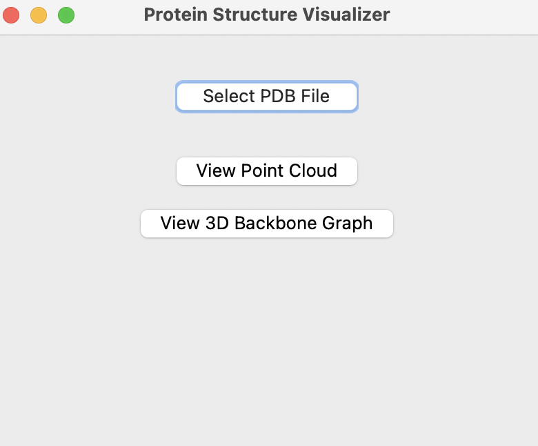
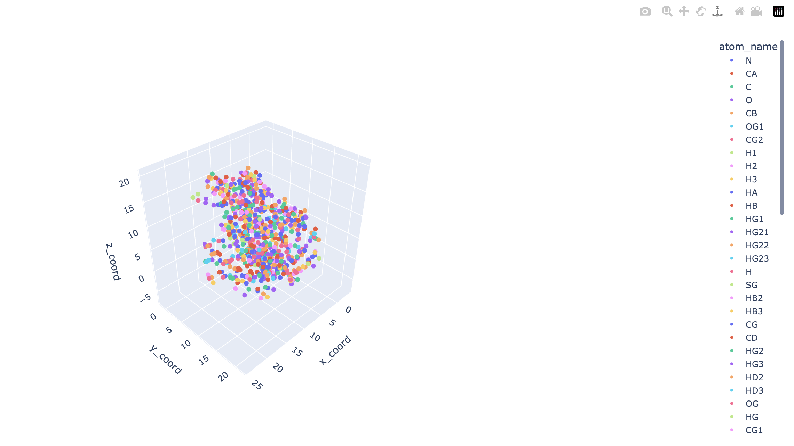
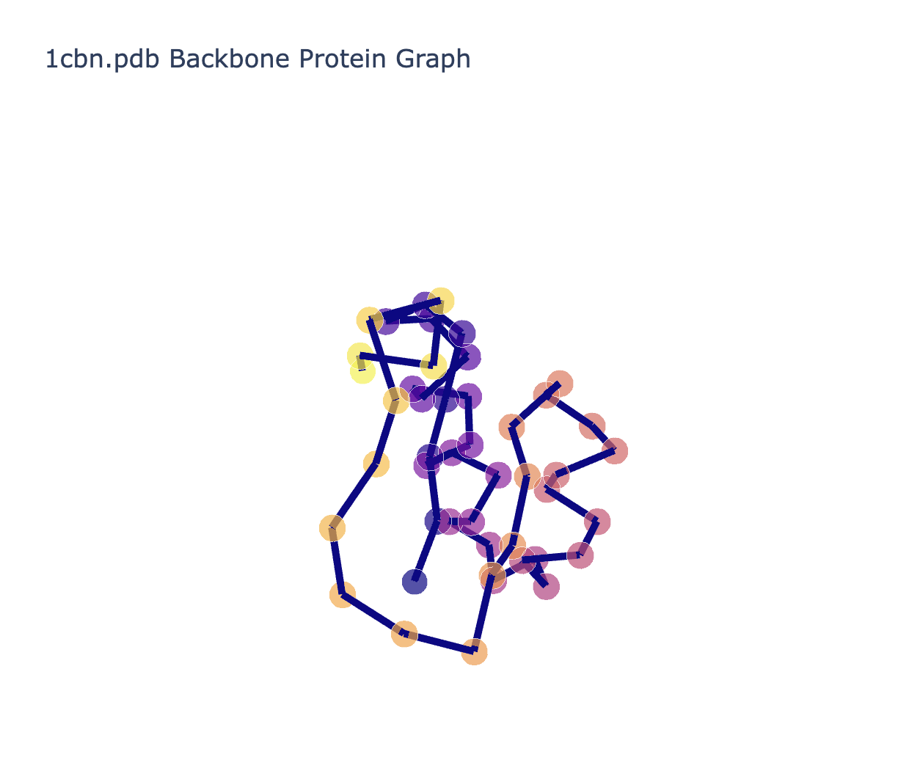

# ProteinStructureVisualizer

Author: Susan Ling

BIOEN537: Computational Systems Biology. University of Washington, Seattle. 

A python package designed to visualize 3D structures of monomeric proteins from PDB files. 

License: MIT
Current version: 1.0.0
Last updated: 2024-12-09

## Background 

Proteins are essential to biological functions, interacting with other proteins, nucleic acids, and organic molecules. Understanding and visualizing protein structures and interactions facilitates a mechanistic understanding of their roles and has applications across fields such as protein engineering and disease treatment. However, current platforms used to achieve this such as PyMOL are complex and require a steep learning curve, making them challenging for students and scientists new to structural biology.

In this package, is a simple GUI for visualizing 3D structures of monomeric proteins from PDB files. The GUI allows users to load PDB files, visualize the protein structure in 3D either as an atom point cloud or a backbone graph, and highlight specific amino acid residues. 

## Installation

### Package Dependencies

This package requires Python 3.7 or higher and the following Python packages:

- pandas: Data manipulation and analysis
- plotly: Interactive visualization
- networkx: Graph operations and analysis  
- biopandas: Handling PDB files
- prody: Protein structure analysis
- graphein: Protein structure graphs
- tkinter: GUI framework

These dependencies will be automatically installed when installing the package using pip.

To install the package, run the following command:

### Installing Package
```bash
pip install ProteinStructureVisualizer
```

## GUI Usage

To use the GUI, run the following command:

```bash
python -m protein_structure_visualizer
```

This will open a window where the user can load in a PDB file (Select PDB File) and visualize the protein structure in 3D. The user will then see a menu with options to visualize the protein structure as an atom point cloud (View Atom Point Cloud) or a backbone graph (View 3D Backbone Graph). This will open a window in the user's default web browser displaying the selected visualization. Once the user is finished, they can exit the GUI by clicking the "x" button in the top left corner of the window. This will display a prompt asking the user if they would like to exit the application. If the user clicks "OK", the GUI will close and the application will terminate. If the user clicks "Cancel", the GUI will continue running. 

Please see the following photos for an example of running the GUI:


*Main window of the Protein Structure Visualizer GUI*


*3D point cloud visualization of protein structure*


*3D backbone graph visualization of protein structure*

